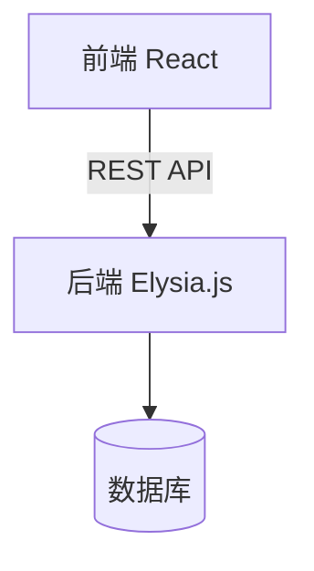

## 定位

```
write-prd → [write-tdd] → scaffold-project → 研发 → code-review → 测试 → deploy
```

TDD 的职责是把 PRD 的「做什么」翻译成「怎么做」：将功能需求转化为数据库表结构、
API 接口、模块划分和技术决策，让研发可以直接按文档开始实现。

## 第一步：获取 PRD 上下文

优先从以下来源读取 PRD 信息（按优先级）：

1. 当前目录 `docs/` 下最新的 `prd-*.md` 文件
2. 用户在对话中提供的 PRD 内容
3. 用户口述的需求描述

从 PRD 中提取：
- 产品名称和核心功能列表
- 目标用户和使用场景
- MVP 功能范围（重点）
- 技术栈（前端、后端、数据库）

若以上均无，向用户询问以下信息（一次性列出，不要逐条追问）：
- 产品名称和核心功能
- 技术栈（未指定则按默认规则推断：前端 React；后端/数据库按项目体量选择）

## 第二步：生成技术设计文档

按以下结构输出 TDD，所有技术均使用最新稳定版本，以官方文档最新版为准。

```
# [产品/功能名称] 技术设计文档

> 关联 PRD：docs/prd-[功能名]-[日期].md

## 技术栈

| 层级 | 技术选型 | 版本要求 |
|------|---------|---------|
| 前端 | React | latest |
| 后端 | Elysia.js | latest |
| 数据库 | SQLite / PostgreSQL | latest |
| 部署 | ... | ... |

## 系统架构

用简洁的文字描述整体架构，说明前后端交互方式（REST / WebSocket 等）、
数据流向和关键模块关系。如有必要，附 Mermaid 架构图：



## 数据库设计

针对每张核心表，给出字段定义、类型、约束和说明。
使用 MVP 功能范围决定哪些表优先实现。

### 表：[表名]

| 字段 | 类型 | 约束 | 说明 |
|------|------|------|------|
| id | INTEGER | PRIMARY KEY | 自增主键 |
| ... | ... | ... | ... |
| created_at | DATETIME | NOT NULL | 创建时间 |
| updated_at | DATETIME | NOT NULL | 更新时间 |

（ER 关系说明：如有表间关联，用文字或 Mermaid 描述）

## API 设计

遵循 RESTful 规范，按资源分组列出接口。

### [资源名]

| 方法 | 路径 | 说明 |
|------|------|------|
| GET | /api/[resource] | 获取列表 |
| GET | /api/[resource]/:id | 获取单条 |
| POST | /api/[resource] | 创建 |
| PUT | /api/[resource]/:id | 更新 |
| DELETE | /api/[resource]/:id | 删除 |

对关键接口补充请求/响应示例：

**POST /api/[resource]**
请求体：
```json
{
  "field1": "string",
  "field2": 0
}
```
响应：
```json
{
  "id": 1,
  "field1": "string",
  "created_at": "2026-01-01T00:00:00Z"
}
```

## 模块划分

### 前端

| 模块/组件 | 职责 | 说明 |
|----------|------|------|
| pages/ | 页面级组件 | 路由对应的顶层页面 |
| components/ | 通用组件 | 可复用 UI 组件 |
| hooks/ | 自定义 Hook | 业务逻辑封装 |
| services/ | API 调用层 | 与后端接口交互 |
| stores/ | 状态管理 | 全局状态 |

### 后端

| 模块 | 职责 | 说明 |
|------|------|------|
| routes/ | 路由定义 | 接口路径和处理器注册 |
| controllers/ | 业务逻辑 | 请求处理和响应组装 |
| models/ | 数据模型 | 数据库操作封装 |
| middlewares/ | 中间件 | 鉴权、日志、错误处理 |

## 关键技术决策

记录重要的技术选型理由，帮助后续开发者理解「为什么这样做」：

| 决策 | 选择 | 理由 |
|------|------|------|
| 状态管理 | ... | ... |
| 身份认证 | ... | ... |
| ... | ... | ... |

## 非功能性需求

| 类别 | 要求 | 实现方案 |
|------|------|---------|
| 安全 | 接口鉴权 | JWT Token |
| 性能 | 接口响应 < 200ms | 合理索引 + 分页 |
| 错误处理 | 统一错误格式 | 全局错误中间件 |
```

## 前端架构（面向用户的产品必须包含此节）

若 PRD 定义的是面向普通用户的 Web 产品（不是纯 API / CLI 工具），TDD 必须包含前端设计：

### 页面与路由

| 路由 | 页面组件 | 功能说明 |
|------|---------|---------|
| `/` | HomePage | 主页 |
| `/[feature]` | FeaturePage | 功能页 |

### 前端模块划分

| 模块 | 路径 | 职责 |
|------|------|------|
| 页面 | `src/client/pages/` | 路由对应的顶层页面组件 |
| 组件 | `src/client/components/` | 可复用 UI 组件 |
| API 调用层 | `src/client/services/api.ts` | 统一封装所有后端请求 |
| 状态管理 | `src/client/stores/` | Zustand 全局状态 |

### 前后端连接

- 开发环境：Vite proxy 转发 `/api/*` 到后端（`localhost:3000`）
- 生产环境：nginx 托管前端静态文件，反向代理 `/api/*` 到后端服务

## 输出规范

- 写入 `docs/tdd-[功能名]-[日期].md`，路径不存在时自动创建
- 同时在对话中展示完整内容
- 需要研发补充的细节用 `[待确认：xxx]` 标注
- 数据库表设计以 MVP 功能范围为准，非 MVP 功能的表可注明「v1.1 实现」
